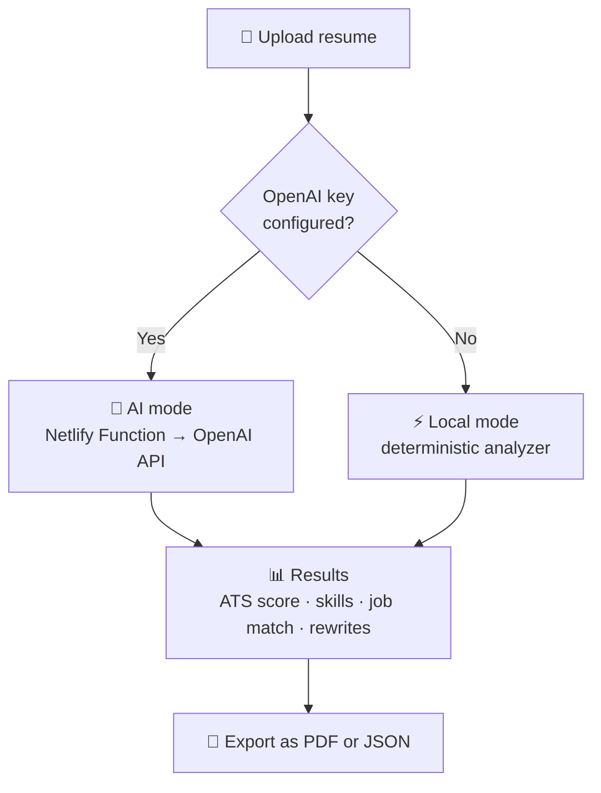

<div align="center">

# 📄 Resume AI

**An AI-powered resume analyzer that scores your resume for ATS compatibility, content quality and skill coverage, matches it against job descriptions, and suggests stronger bullet points.**

<br>

[](https://furqanresumeanalyzer.netlify.app/)

<br>


</div>

---

## 📑 Table of Contents

- [Overview](#-overview)
- [Features](#-features)
- [How It Works](#-how-it-works)
- [Tech Stack](#-tech-stack)
- [Getting Started](#-getting-started)
- [OpenAI Configuration](#-openai-configuration)
- [Deployment](#-deployment)
- [Security](#-security)
- [Author](#-author)

---

## 🔭 Overview

Resume AI helps job seekers improve their resumes for ATS compatibility, content quality, skill coverage and job matching.

It runs in two modes:

- **AI mode:** when an OpenAI API key is configured, the app provides AI-powered analysis and rewriting through a server-side Netlify Function.
- **Local mode:** when no key is configured, a deterministic local analyzer still provides core resume analysis, so the app stays useful without any external AI service.

🔗 **Live demo:** [furqanresumeanalyzer.netlify.app](https://furqanresumeanalyzer.netlify.app/)

---

## ✨ Features

| Feature | Details |
| ------- | ------- |
| 📄 **Resume upload** | Upload a resume (PDF/DOCX) and analyze it |
| 📊 **ATS score** | Evaluate the resume for ATS compatibility |
| 🧠 **Skill coverage** | Identify the skills present and the areas that need work |
| 💼 **Job description matching** | Compare the resume against a target job description |
| 🤖 **AI analysis** | Intelligent feedback on resume quality and content *(AI mode)* |
| ✍️ **AI rewrite suggestions** | Stronger bullet-point recommendations *(AI mode)* |
| ⚡ **Local fallback analyzer** | Deterministic analysis when no OpenAI key is configured |
| 📑 **PDF export** | Export the analyzed report as a PDF |
| 🔄 **JSON export** | Export the analysis results as JSON |
| 🌐 **Netlify Functions** | AI requests are handled server-side |

---

## ⚙️ How It Works



The OpenAI API key stays on the server and is never exposed to the browser.

---

## 🛠️ Tech Stack

| Layer | Technology |
| ----- | ---------- |
| **Frontend** | React, JavaScript |
| **Build tool** | Vite |
| **Styling** | Tailwind CSS |
| **Serverless** | Netlify Functions |
| **AI** | OpenAI API (optional) |
| **Hosting** | Netlify |

---

## 🚀 Getting Started

### Prerequisites

- Node.js and npm
- Git
- An OpenAI API key *(optional; without one the app uses the local analyzer)*

### Installation

```bash
git clone https://github.com/furqanzubair209-cell/furqanresumeanalyzer.git
cd furqanresumeanalyzer
npm install
```

### Run locally

```bash
npm run dev
```

Vite prints a local URL, usually `http://localhost:5173/`.

### Production build

```bash
npm run build
npm run preview
```

---

## 🔑 OpenAI Configuration

OpenAI integration is optional. To enable AI mode, set this environment variable:

```env
OPENAI_API_KEY=your_openai_api_key
```

> [!IMPORTANT]
> The variable must be named exactly `OPENAI_API_KEY`. Do **not** use `VITE_OPENAI_API_KEY`, because `VITE_` variables are exposed to the browser.

Configure it server-side through your Netlify environment variables (see below).

---

## 🌐 Deployment

Resume AI is configured for Netlify. The existing `netlify.toml` handles the build and Functions setup.

1. Push the project to GitHub.
2. In Netlify, choose **Add new project → Import an existing project → GitHub** and select this repository.
3. Use these build settings:

   | Setting | Value |
   | ------- | ----- |
   | Build command | `npm run build` |
   | Publish directory | `dist` |

4. Go to **Project configuration → Environment variables** and add `OPENAI_API_KEY` with your key.
5. Trigger a new deployment. Netlify will provide a public URL.

Once GitHub and Netlify are connected, pushing to the configured branch triggers a new deployment automatically.

---

## 🔒 Security

Keep your OpenAI API key server-side at all times.

- Never commit API keys, `.env` files or `node_modules/` to GitHub.
- Never put API keys in React components.
- Never expose keys through frontend environment variables.
- Never share keys in screenshots or public repositories.

If a key is ever exposed, revoke it and create a new one.

---

## 👨‍💻 Author

**Muhammad Furqan** — AI/ML Developer & Full-Stack Engineer

[](https://github.com/furqanzubair209-cell)
[](https://www.linkedin.com/in/muhammad-furqan-228807304/)
[](https://furqannewportfolio.netlify.app/)

---

## 📄 License

This project is provided for educational and development purposes.

<div align="center">

⭐ If you find this project useful, consider giving the repository a star.

</div>


